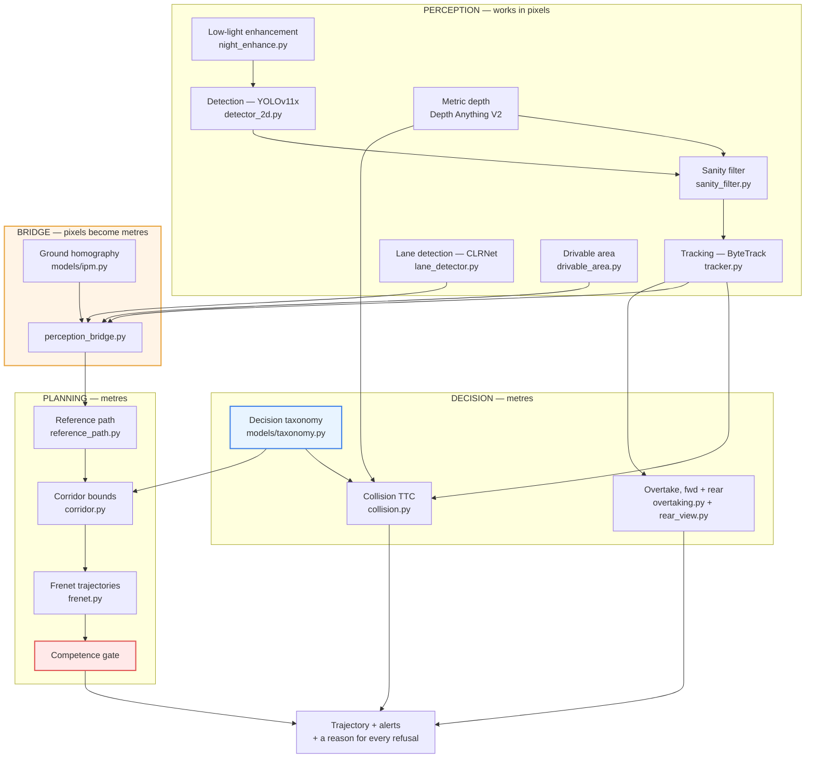

# Implementation Guide — Krish

Everything in this repository is built and tested. Your job is to **run it on
the HPC** and report what comes back. This document is the only one you need.

**Read this first:** every job below has already been dry-run locally. If a job
fails, it is almost certainly the environment or a missing input, not the code
— §7 lists every failure this cluster has produced so far and what each looks
like in a log.

---

## CONTENTS

1. [What the system does](#1-what-the-system-does)
2. [Architecture — the modules and how they connect](#2-architecture)
3. [Data flow — one frame, end to end](#3-data-flow--one-frame-end-to-end)
4. [Getting the code onto the cluster](#4-getting-the-code-onto-the-cluster)
5. [Getting the data](#5-getting-the-data)
6. [Running the jobs, one at a time](#6-running-the-jobs-one-at-a-time)
7. [When something fails](#7-when-something-fails)
8. [Bringing results back](#8-bringing-results-back)
9. [What is done and what is not](#9-what-is-done-and-what-is-not)

---

## 1. WHAT THE SYSTEM DOES

One dashcam frame goes in. Out comes a **driveable trajectory in metres**, plus
collision alerts, an overtaking verdict, and — this part matters — a stated
reason whenever the system declines to produce one.

The problem it solves: standard trajectory planners (Frenet, the one MATLAB
ships) need a **lane centreline** as input. Unmarked Indian roads do not have
one. We synthesise that centreline from **drivable free space** instead, size
the safety margins by **what each obstacle is**, and refuse to commit to a path
running through space the sensors never observed.

Three ideas carry the whole system:

**Classify by consequence, not appearance.** The detector kept confusing
truck / bus / tanker / tractor. But a planner treats all four identically:
large, slow to stop, blocks the view. So classes are grouped by *what the
decision layer must do differently* — six groups, each carrying a lateral
clearance in metres and a time-to-collision margin. Collapsing those four into
`HEAVY_VEHICLE` removes that confusion by construction and loses nothing
downstream.

**Price errors by consequence.** mAP scores "bus called a truck" and
"pedestrian called a barrier" identically. Only the second removes a
protection. Our metric (**SWMC**) makes that asymmetry explicit, with the
scale's ceiling at the genuinely worst event — a vulnerable road user never
detected at all.

**Know what you cannot know.** The overtake rule refuses when the rear view
does not reach as far as the manoeuvre needs. The curvature estimate errs
toward reporting a *sharper* curve. The collision layer reports its own
measurement coverage, so silence from a blinded tracker is distinguishable from
silence on an empty road.

---

## 2. ARCHITECTURE



**Blue is the taxonomy.** Note it feeds *both* the collision layer and the
planner's corridor. That is the link that makes classification consequential:
the group a detection lands in literally sets how wide a berth the vehicle
leaves it. Change the group, and the vehicle drives differently.

**Orange is the bridge.** Everything above it works in pixels; everything below
works in metres. That boundary is where the hardest bug in this project lived
(§9).

**Red is the competence gate.** The last thing before output: if the planned
path extends past what the sensors resolved, it is truncated and the speed
reduced, never extrapolated.

### Where each file lives

| Concern | File |
|---|---|
| Six decision groups, clearances, SWMC costs | `models/taxonomy.py` |
| Camera → ground homography | `models/ipm.py` |
| Detection, tracking, depth, lanes | `models/`, `inference/` |
| Perception → planning conversion | `planning/perception_bridge.py` |
| Free space → reference path | `planning/reference_path.py` |
| Corridor bounds from obstacles | `planning/corridor.py` |
| Trajectory generation + competence gate | `planning/frenet.py` |
| The whole pipeline, one frame in | `inference/adas_final.py` |
| Dataset ingest (any format → YOLO) | `data/prepare_indian.py` |
| Label-space collapsing | `data/prepare_taxonomy.py` |
| Detection metrics | `evaluation/evaluate_swmc.py` |
| Night / condition metrics | `evaluation/evaluate_conditions.py` |
| Closed-loop planner metrics | `evaluation/evaluate_planning.py` |
| 260 automated checks | `scripts/verify_adas_pipeline.py` |

---

## 3. DATA FLOW — ONE FRAME, END TO END

Follow a single frame through `inference/adas_final.py::process_frame`:

**1. Lighting.** `scene_lighting(gray)` returns `DAY` / `NIGHT_LIT` /
`NIGHT_UNLIT`. Dark frames go through Zero-DCE++ (or CLAHE if the weights are
missing).

**2. Detection.** YOLOv11x produces boxes. Class names come from whatever the
model was trained on.

**3. Sanity filter.** Each box is checked against the pinhole model: an object
`w` pixels wide at distance `d` implies a physical width `W = w·d/f`. If that
width is impossible for its class, the box is dropped. This is what catches
detections hallucinated onto billboards and reflections.

**4. Tracking.** ByteTrack assigns IDs. **Distance history is carried across ID
switches** by matching box overlap — without that, an ID switch resets the
history and the collision layer goes silent for several frames. Measured: at an
ID switch every 3 frames, closing-speed coverage drops from 0.93 to **0.00**.

**5. Depth → collision.** Distance from Depth Anything V2, closing speed from
the distance history, TTC = distance / closing speed. Thresholds are **scaled
by decision group** — a pedestrian gets a 2.70 s brake threshold against a
car's 1.50 s.

**6. Overtaking.** Legality (solid line), geometry (curve radius in metres via
IPM), visibility, oncoming traffic, and the rear check. The manoeuvre window
comes from **IRC:66 overtaking sight distance**, not a hardcoded constant.

**7. Planning.** This is where pixels become metres:

```
drivable mask (pixels)
    → ground_grid_from_mask()      backward warp through the homography
    → GroundGrid                   bird's-eye occupancy, 0.2 m cells
    → reference_path_from_free_space()
                                   scan forward, take the midpoint of the
                                   connected drivable interval at each station
    → ReferencePath                the centreline Frenet needs, synthesised

tracked boxes (pixels)
    → obstacles_from_tracks()      bottom-centre of each box projected to ground
    → [Obstacle]                   each carrying its decision group

ReferencePath + [Obstacle]
    → build_corridor()             lateral bounds; each obstacle's group sets
                                   how far the corridor narrows beside it
    → Corridor                     hard bounds (where things ARE) and
                                   soft bounds (where they MIGHT BE)

Corridor
    → FrenetPlanner.plan()         quintic lateral, quartic longitudinal,
                                   sampled over end states, scored
    → competence gate              truncate to observed road
    → Trajectory
```

`FrameResult.plan_status` always says what happened: `planned`, `planned,
truncated to observed road`, `no feasible trajectory: corridor blocked`, `no
camera-to-ground calibration`, and so on. **A missing trajectory has several
very different causes and they call for different responses** — never read a
`None` as "the road is clear".

---

## 4. GETTING THE CODE ONTO THE CLUSTER

### Option A — git (preferred)

Line endings stay correct automatically. `.gitattributes` forces LF on `.pbs`
and `.sh`, which matters: a CRLF checkout makes Linux report
`bad interpreter: /bin/bash^M`, which reads like a missing shell.

```bash
ssh USER@CLUSTER
cd ~
git clone <repo-url> IBM_Internship
cd IBM_Internship/autonomous_detection
git checkout krish-implementation
```

Every time after:

```bash
cd ~/IBM_Internship && git pull
```

### Option B — scp from Windows

From PowerShell, in the project folder:

```powershell
scp -r autonomous_detection USER@CLUSTER:~/IBM_Internship/
```

**Then fix line endings**, because Windows will have written CRLF:

```bash
ssh USER@CLUSTER
cd ~/IBM_Internship/autonomous_detection
sed -i 's/\r$//' training/pbs/*.pbs scripts/*.sh
```

Skip that and every job dies instantly.

### One-time setup

```bash
cd ~/IBM_Internship/autonomous_detection
mkdir -p logs results
```

**PBS cannot create the log directory itself.** Without `logs/` the job is
rejected before it starts — and since the log is the thing that failed, you get
no explanation.

### Verify before anything else

```bash
source /home/soft/anaconda3/etc/profile.d/conda.sh
conda activate auto_det
python scripts/verify_adas_pipeline.py
```

Expect `ALL CHECKS PASSED (260/260)`. Runs on the login node, needs no GPU,
takes about a minute. **If anything fails, stop and tell Vishal** — the failure
is real and the jobs will hit it hours in.

---

## 5. GETTING THE DATA

The problem statement names **IDD** (https://idd.insaan.iiit.ac.in/) and
Mendeley Indian traffic datasets. Registration is required for IDD.

Whatever you download, one command converts it:

```bash
# See what is in it before converting anything
python data/prepare_indian.py --src data/IDD_Detection --out data/idd_yolo --report-only
```

That prints every class name, its box count, and which decision group it maps
to. **Read the "unrecognised" line.** An unrecognised class is data about to be
silently discarded, and it is far cheaper to see it here than to notice a
missing class after training.

If everything maps, convert for real:

```bash
python data/prepare_indian.py --src data/IDD_Detection --out data/idd_yolo
```

It auto-detects VOC XML, COCO JSON or YOLO txt, so the same command works for
DATS_2022, HeteroTraffic, IndiaScene365 and Indistreet2K25.

Source class names are **preserved**, not collapsed. The collapsing happens
later, at whichever granularity is being tested, so the mapping lives in exactly
one place.

---

## 6. RUNNING THE JOBS, ONE AT A TIME

**Read each job's log before submitting the next.** These are chained: step 2
cannot succeed if step 1 half-finished, and a job that dies in its first thirty
seconds still holds a queue slot until you notice.

### Job 1 — build the three label spaces (CPU, ~1 h)

```bash
qsub training/pbs/granularity_step1_prepare.pbs
```

Takes the converted dataset and emits three copies containing the **same images
and the same boxes**, differing only in how those boxes are labelled:

| Level | Classes | What it tests |
|---|---|---|
| `fine` | the source dataset's own | the control |
| `semantic` | grouped by appearance | the second control |
| `decision` | our six groups | ours |

The second control is what makes the experiment mean anything. Without it a
reviewer can only conclude "fewer classes scores higher", which is trivially
true.

**Read the mapping report at the top of the log first.** It runs in seconds and
stops the job if more than 5% of boxes belong to classes the taxonomy does not
recognise — catching a mapping hole in seconds instead of after 24 GPU-hours.

Watch it:

```bash
qstat -u $USER              # R = running, Q = queued
tail -f logs/gran_step1.log # Ctrl-C stops watching, not the job
```

**Done when the log ends with:**

```
OK: all three label spaces cover identical boxes.
```

**Check before moving on:**

```bash
ls data/gran_fine data/gran_semantic data/gran_decision
```

If the three box counts differ, **do not continue** — the comparison would be
measuring a difference in data rather than in taxonomy.

### Job 2 — train the three arms (GPU, ~8–24 h each)

Independent; they can queue together. Give each its own name and log or they
overwrite each other:

```bash
qsub -N gran_fine     -o logs/gran_fine.log     -v LEVEL=fine \
     training/pbs/granularity_step2_train.pbs

qsub -N gran_semantic -o logs/gran_semantic.log -v LEVEL=semantic \
     training/pbs/granularity_step2_train.pbs

qsub -N gran_decision -o logs/gran_decision.log -v LEVEL=decision \
     training/pbs/granularity_step2_train.pbs
```

If the queue gives you one GPU at a time, submit them one after another — order
does not matter.

**Every hyperparameter, including the random seed, is identical across the
three. Do not tune one arm and not the others** — that is the entire basis of
the claim.

**Watch the first minute.** Most failures happen in the first thirty seconds:

```bash
tail -f logs/gran_decision.log
```

The first lines must read:

```
python : /home/soft/anaconda3/envs/auto_det/bin/python
conda environment: OK
```

If you see `python resolved to /bin/python`, the job aborts by design — the
environment did not activate.

**Check:** `ls runs/granularity/*/weights/best.pt` — all three must exist.

### Job 3 — the comparison (GPU, ~2 h)

```bash
qsub training/pbs/granularity_step3_compare.pbs
```

Scores all three models in **one common six-group space**, whatever space each
was trained in, at two confidence thresholds so the conclusion is not an
artefact of one operating point.

**This produces the main results table.**

```bash
cat results/granularity_comparison.json
```

Report **SWMC**, **critical-error rate**, **group accuracy** and **recall** —
all measured in the same space, all comparable. Native mAP is printed too but
is **not** comparable across rows, because fewer classes is an easier problem.
The job prints that warning next to the table; keep it.

### Job 4 — night and low light (GPU, ~3 h)

```bash
qsub -v LEVEL=decision training/pbs/india_night_eval.pbs
```

Buckets the validation set with the pipeline's own `scene_lighting()` and
reports SWMC per condition, plus the enhancement ablation.

Two things to read honestly:

- A bucket flagged **"too few images"** — report the count, not the metric.
- If enhancement comes out **neutral or negative, that is the finding**, not a
  failure. Enhancement can amplify noise into texture a domain-shifted detector
  reads as an object.

### Job 5 — closed-loop planning (CPU, ~20 min)

```bash
python evaluation/evaluate_planning.py --seeds 20 --out results/planning.json
```

No GPU needed; run it on the login node or an interactive session. Runs the
planner over five Indian scenarios with three ablations — grouped clearances,
uniform clearances, and the competence gate disabled.

**Read the VULNERABLE-gap column first.** It is the body-to-body distance the
vehicle actually left a pedestrian or animal, measured from the scenario's true
agent positions rather than from what the planner believed. If `grouped` does
not beat `uniform` there, the taxonomy is not earning its place and we say so
in the paper.

### Job 6 — run on real video (GPU, interactive)

```bash
qsub -I -l select=1:ncpus=8:ngpus=1:mem=40gb -q gpu -l walltime=02:00:00

cd ~/IBM_Internship/autonomous_detection
source /home/soft/anaconda3/etc/profile.d/conda.sh
conda activate auto_det

python inference/adas_final.py \
    --source demo/india_clip.mp4 \
    --weights runs/granularity/decision/weights/best.pt \
    --save out_annotated.mp4 \
    --log decisions.jsonl
```

(`--source`, not `--video`.)

**Read the `[collision]` block at the end** — it tells you whether tracking is
starving the collision layer:

```
[collision] 18432 object sightings over 3604 frames
  closing-speed coverage : 0.87
  new track ids          : 412 (11.4 per 100 frames)
  histories rescued      : 96
```

- **coverage below 0.60** — the collision layer frequently could not measure,
  so quiet stretches do **not** mean the road was clear.
- **rescued > ~30% of new ids** — the recovery is holding the module up but the
  tracker is unstable. Then, and only then, try `botsort.yaml` or a longer
  `track_buffer`. The number decides it, not a hunch.

### Watching jobs — the commands you will actually use

```bash
qstat -u $USER              # your queued and running jobs
qstat -f <jobid>            # why a job is stuck, or its exit status
tail -f logs/<name>.log     # live output
qdel <jobid>                # kill a job
ls -la runs/ results/       # what has actually been produced
```

---

## 7. WHEN SOMETHING FAILS

Every failure this cluster has produced so far, and what it looks like:

| In the log | Cause | Fix |
|---|---|---|
| `python: /bin/python`, then import errors | `#PBS -V` exported CONDA_SHLVL, so `conda activate` silently did nothing | already removed from every script; if you see it, a stale script came back |
| `PYTHONPATH: unbound variable` | `set -u` with an unset variable | already removed |
| `bad interpreter: /bin/bash^M` | CRLF line endings from a Windows copy | `sed -i 's/\r$//' training/pbs/*.pbs` |
| job rejected immediately, no log at all | `logs/` does not exist | `mkdir -p logs` |
| `pip: command not found` | console scripts not on PATH in a batch shell | already handled via `python -m pip` |
| `ModuleNotFoundError: No module named 'models'` | entry point run without the project root on `sys.path` | already fixed in every entry point |
| `ERROR: missing runs/granularity/.../best.pt` | a previous job has not finished | wait for it; the job checks its inputs on purpose |

**A job that exits within thirty seconds is almost always the environment, not
your data.** The scripts check for that explicitly and abort with a clear
message rather than failing confusingly an hour later.

---

## 8. BRINGING RESULTS BACK

```powershell
scp -r USER@CLUSTER:~/IBM_Internship/autonomous_detection/results ./results_from_hpc
scp -r USER@CLUSTER:~/IBM_Internship/autonomous_detection/logs ./logs_from_hpc
scp USER@CLUSTER:~/IBM_Internship/autonomous_detection/out_annotated.mp4 .
```

Weights are large. If you only need the numbers, `results/` and `logs/` are
enough.

---

## 9. WHAT IS DONE AND WHAT IS NOT

### Built and tested — 260 automated checks

| Capability | Checks |
|---|---|
| Decision taxonomy (6 groups) | 23 |
| SWMC safety metric | 32 |
| Collision survives tracker ID churn | 11 |
| Collision margins scale by group | 10 |
| Metric curvature, validated against known arcs | 8 |
| Overtake, forward + rear, IRC:66 window | 27 |
| Phantom-detection sanity filter | 11 |
| Path planning: reference, corridor, Frenet, gate | 32 |
| Perception → planning bridge | 21 |
| Graceful degradation of optional modules | 14 |
| Everything else | 71 |

### Defects the checks caught — worth knowing, because most were unsafe

| Defect | What it did |
|---|---|
| **Ground homography was the identity matrix** | `from_intrinsics` built `K(R − t·nᵀ/d)K⁻¹` with `t` hardcoded to zero, which cancels the entire plane term. `pixel_to_ground` returned its input, so every "metric" quantity — curve radii, obstacle positions, corridor widths — was **in pixels wearing a metres label** |
| Curvature evaluated at the far end of the polyline | Every road read **straighter** than it is: a 50 m switchback reported as 135 m. Permits overtakes the geometry does not support |
| Right-hand-traffic convention hardcoded | Treated own-lane vehicles as oncoming and **ignored genuine head-on traffic**. India drives on the left |
| Distance history keyed on track ID | ID switch every 3 frames → collision coverage **0.00**, silently |
| Only static objects produced hard corridor bounds | A traffic cone diverted the vehicle; **a pedestrian did not** |
| Obstacles shorter than the station spacing | A pedestrian could constrain **nothing** and be invisible to the corridor builder |
| Closing speed never set on oncoming vehicles | Overtaking treated approaching cars as stationary |

### Not built

- **Motion prediction** for surrounding agents. The corridor sweeps obstacles
  along their current velocity, which is a constant-velocity model, not a
  learned prediction.
- **The MATLAB/Simulink port.** The algorithms are verified in Python
  specifically so the port is a translation of working logic rather than fresh
  untested code.
- **LiDAR and radar.** Camera only.
- **RoadRunner scenes.**

### If you get stuck

The verification suite is the fastest diagnostic. Run it first, always:

```bash
python scripts/verify_adas_pipeline.py
```

It is GPU-free, takes a minute, and has caught nine defects that would
otherwise have surfaced only after hours of cluster time — including two that
were already running.
