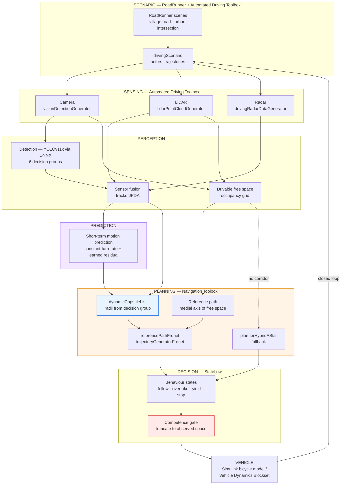

# Adaptive Path Planning and Collision Avoidance for Autonomous Vehicles on Unstructured Indian Roads

**Smart India Hackathon 2026 · Problem Statement SIH26037 · Organisation: MathWorks**
Theme: Robotics and Drones · Category: Software

**Team:** Krish Manwani · Vishal Bansal
**Guided by:** Pranshu Chander · Bhushan Singh Negi

---

## CONTENTS

1. [What the problem statement requires](#1-what-the-problem-statement-requires)
2. [Why this problem is hard](#2-why-this-problem-is-hard)
3. [The research gap we are filling](#3-the-research-gap-we-are-filling)
4. [System architecture](#4-system-architecture)
5. [The MathWorks toolchain, module by module](#5-the-mathworks-toolchain-module-by-module)
6. [The five required scenarios](#6-the-five-required-scenarios)
7. [What already exists, and how it transfers](#7-what-already-exists-and-how-it-transfers)
8. [Build plan](#8-build-plan)
9. [Metrics and validation](#9-metrics-and-validation)
10. [Deliverables checklist](#10-deliverables-checklist)
11. [Future scope — drones, escalation, deployment](#11-future-scope--drones-escalation-deployment)
12. [Risks, stated plainly](#12-risks-stated-plainly)
13. [References](#13-references)

---

## 1. WHAT THE PROBLEM STATEMENT REQUIRES

This is a **MathWorks** problem statement. It asks for a **closed-loop
MATLAB/Simulink simulation**, not a deployed system. Reading it literally is the
first requirement:

| Required | Our position |
|---|---|
| Perception via **camera, LiDAR and radar** | Multi-sensor fusion in Automated Driving Toolbox |
| Identify auto-rickshaws, pushcarts, pedestrians, **animals** | Our decision-grouped taxonomy covers exactly these |
| **Predict short-term motion** of surrounding agents, including non-lane-based movement | **New work** — §5.3 |
| Generate a **collision-free path, replanned in real time** | Frenet + Hybrid A\* in Navigation Toolbox |
| Handle missing lane markings, informal merging, sudden pedestrian movement | The core of our approach — §3 |
| **≥ 5 realistic Indian scenarios** | §6 |
| **≥ 2 detailed RoadRunner scenes** (village road, urban intersection) | §6 |
| Integrate perception → prediction → planning → decision → vehicle motion | §4 |
| Metrics: **replanning latency, path smoothness, scenario completion rate** | §9 |
| Simulation model, scenarios, results, technical report, demo video | §10 |

**Three things the statement asks for that we do not yet have:**
LiDAR and radar sensing, **agent motion prediction**, and the RoadRunner scenes.
Sections 5 and 8 are how we close them.

---

## 2. WHY THIS PROBLEM IS HARD

### "Unstructured Indian Roads"

| Assumption most systems make | Reality on these roads |
|---|---|
| Lane markings exist and are visible | Often absent, faded, or ignored |
| Traffic keeps lane discipline | Vehicles occupy whatever space exists |
| Traffic is cars, trucks, buses, pedestrians | Plus auto-rickshaws, pushcarts, cattle, tractors |
| Two-wheelers behave like small cars | They filter *between* vehicles, laterally, without warning |
| Road edges are well-defined | Edge merges into shoulder, dirt, shopfront |
| Agents signal before manoeuvring | Merging without signalling; crossing at unmarked points; driving against traffic |
| Right-hand traffic (US/EU) | **India drives on the left** — the oncoming lane is on the *right* |

That last row is not a footnote. Nearly every published pipeline is trained on
KITTI, BDD100K or Cityscapes and inherits the right-hand-traffic convention
silently. Ported to India unchanged, it treats own-lane vehicles as oncoming and
**ignores genuine head-on traffic**. We found exactly that defect in our own code
and made the convention an explicit parameter.

### "Adaptive"

Behaviour must change with the situation — adaptive to **what the obstacle is**
(a pedestrian and a pushcart demand different clearance), to **road geometry**
(a village road is not a highway), and — the part most systems skip — to **how
much the sensors can currently see**.

---

## 3. THE RESEARCH GAP WE ARE FILLING

### How local planning is normally done

**Frenet-frame trajectory generation** (Werling, Ziegler, Kammel and Thrun,
ICRA 2010) is the backbone of Apollo, Autoware — and of MATLAB's own
`trajectoryGeneratorFrenet`. The road centreline becomes the *s* axis, lateral
offset becomes *d*, and planning decouples into a quintic polynomial laterally
and a quartic longitudinally.

The **Frenet Corridor Planner** (Honda Research Institute, 2025) refines this
into constrained optimisation inside a drivable corridor, reporting **0.035 s**
solve time against **0.17–0.63 s** for A\*, RRT\* and B-RRT\*.

For genuinely unstructured space the reference is **Hybrid A\*** (Dolgov, Thrun,
Montemerlo and Diebel, IJRR 2010) — available in MATLAB as
`plannerHybridAStar`.

### The gap

```
        Frenet family                          Hybrid A*
   ┌────────────────────────┐          ┌────────────────────────┐
   │ fast (0.035 s)         │          │ no centreline needed   │
   │ smooth, comfortable    │          │ handles open space     │
   │ ✗ NEEDS A CENTRELINE   │          │ ✗ 5-18x slower         │
   └────────────────────────┘          └────────────────────────┘
                  ╲                            ╱
                    ▼                        ▼
        Unmarked Indian road at 40-60 km/h:
        a clear direction of travel, but no marked lanes
                         ↓
                  NEITHER FITS
```

MATLAB's `referencePathFrenet` requires a reference path as its **input**. On a
marked highway the map or lane detector supplies it. **On an unmarked village
road, nothing does.** That is not a MATLAB limitation — it is the state of the
field.

### What the Indian-roads literature has established

Almost entirely from IIIT-Hyderabad:

- **IDD** (WACV 2019) — Cityscapes/KITTI-trained models transfer poorly here;
  introduced a **drivable-fallback** class because "road" and "drivable but not
  road" are different things.
- **IDD-AW** (WACV 2024) — night, rain, fog, snow; introduced **Safe mIoU**, the
  idea that a label hierarchy should penalise *dangerous* mispredictions more.
- **IDD-X** (ICRA 2024) — dual-view including rear, ego-relative important
  objects.
- **Diffusion-FS** (2025) — **multimodal free-space** prediction on IDD, because
  the drivable answer here is genuinely ambiguous.

The community has converged on **free space** as the representation, because
lanes are unavailable. What is missing is the bridge from free space to a
**committed, kinematically feasible trajectory**.

### Our answer

> **Synthesise the reference path from drivable free space instead of from lane
> markings, size the collision-checking bodies by what each obstacle *is*, and
> refuse to commit where the sensors cannot see far enough to justify the
> manoeuvre.**

Three ideas carry it, and all three map cleanly onto MathWorks tooling:

**One — classify by consequence, not appearance.** Our detector kept confusing
truck / bus / tanker / tractor. But a planner treats all of them identically:
large, slow to stop, blocks the view. So classes are grouped by *what the
decision layer must do differently*. Each group carries a **lateral clearance in
metres** — which becomes the **capsule radius in `dynamicCapsuleList`**. The
taxonomy does not merely label the scene; it *parameterises the collision
checker*.

| Group | Members | TTC margin | Lateral clearance | Blocks view |
|---|---|---|---|---|
| VULNERABLE | pedestrian, rider, animal | ×1.8 | 1.5 m | no |
| TWO_WHEELER | motorcycle, bicycle | ×1.4 | 1.2 m | no |
| THREE_WHEELER | auto-rickshaw | ×1.2 | 1.0 m | no |
| LIGHT_VEHICLE | car, van, jeep, SUV | ×1.0 | 0.8 m | no |
| HEAVY_VEHICLE | truck, bus, tractor, tanker | ×1.3 | 1.0 m | **yes** |
| STATIC_OBSTACLE | pushcart, barrier, cone, debris | ×1.0 | 0.8 m | no |

**Two — price errors by consequence (SWMC).** mAP scores "bus called a truck"
and "pedestrian called a barrier" identically; only the second removes a
protection. Extending IDD-AW's Safe-mIoU principle to detection, the scale's
ceiling is anchored at the genuinely worst event — a vulnerable road user never
detected at all (cost 1.00), against 0.10 for an over-cautious error.

**Three — a system that knows what it cannot know.** The overtake rule refuses
when the rear view does not reach as far as the manoeuvre needs; the curvature
estimate errs toward reporting a *sharper* curve; the collision layer reports
its own measurement coverage. *"I see nothing" is never recorded as "nothing is
there."* In Simulink this becomes an explicit **Stateflow** state, not an
implicit assumption.

---

## 4. SYSTEM ARCHITECTURE



**Reading it:** purple is motion prediction, which the statement requires and we
must build. Orange is planning. Blue is the collision checker whose capsule radii
come from the taxonomy — the link that makes classification consequential. Red is
the competence gate. The loop closes back into `drivingScenario`, which is what
"closed-loop validation" means.

---

## 5. THE MATHWORKS TOOLCHAIN, MODULE BY MODULE

### 5.1 Scenario and sensing

| Need | Tool | Function |
|---|---|---|
| Scene authoring | **RoadRunner** | Village road, urban intersection (§6) |
| Scenario / actors | **Automated Driving Toolbox** | `drivingScenario`, `roadNetwork`, actor trajectories |
| Camera | Automated Driving Toolbox | `visionDetectionGenerator` |
| LiDAR | Automated Driving Toolbox | `lidarPointCloudGenerator` |
| Radar | Automated Driving Toolbox | `drivingRadarDataGenerator` |
| Fusion | Automated Driving Toolbox / Sensor Fusion | `trackerJPDA` — chosen over GNN because Indian traffic is dense and closely spaced, which is exactly where joint probabilistic association earns its cost |
| Free space | Navigation Toolbox | `binaryOccupancyMap` / `occupancyMap` from LiDAR + camera segmentation |

### 5.2 Detection

Our YOLOv11x model, trained on Indian data in the six decision groups, is
exported to **ONNX** and imported with **Deep Learning Toolbox**
(`importNetworkFromONNX`). This is the single biggest saving: the detector is
already trained and validated, and does not need rebuilding in MATLAB.

### 5.3 Motion prediction — new work

The statement explicitly requires predicting *"short-term motion of surrounding
agents, including non-lane-based and irregular movement patterns."* Two stages:

1. **Kinematic baseline** — constant turn-rate and acceleration per track, from
   the fused state. Cheap, always available, and the fallback when the learned
   model is out of distribution.
2. **Group-conditioned learned residual** — a small LSTM or temporal-CNN
   (Deep Learning Toolbox) predicting the *deviation* from the kinematic
   baseline, **conditioned on the decision group**. This is where Indian-road
   behaviour is captured: a two-wheeler's plausible lateral motion over 3 s is
   nothing like a bus's, and a pedestrian's is different again.
3. **Multimodal output** — top-*k* hypotheses with probabilities, not a single
   path, following the Diffusion-FS argument that the answer here is genuinely
   ambiguous. Each hypothesis becomes a capsule in the collision check, weighted
   by probability.

### 5.4 Planning

| Stage | Tool | Note |
|---|---|---|
| Reference path | **ours** | Medial axis of the free-space corridor, projected to the ground plane and spline-smoothed. Where lane markings exist, the lane centre is used and the medial axis becomes a cross-check |
| Frenet frame | Navigation Toolbox | `referencePathFrenet` |
| Trajectory generation | Navigation Toolbox | `trajectoryGeneratorFrenet` — sampled terminal states |
| Collision checking | Navigation Toolbox | `dynamicCapsuleList` — **ego and obstacle capsule radii set per decision group** |
| Unstructured fallback | Navigation Toolbox | `plannerHybridAStar` where no coherent corridor exists (market, open junction) |
| Feasibility | — | Kinematic bicycle curvature limit |

Candidate scoring:

```
J = w_jerk·J_comfort + w_dev·J_deviation + w_clear·J_clearance + w_prog·J_progress
```

Rejected outright if it leaves the corridor, exceeds the curvature limit, or
intersects any predicted capsule over the horizon.

### 5.5 Decision logic — Stateflow

Behaviour states: **CRUISE · FOLLOW · OVERTAKE · YIELD · STOP · CREEP**, with
transitions driven by TTC (margins scaled by decision group), the IRC:66
overtaking window, road curvature, and the competence gate.

`CREEP` matters for the market scenario: where the corridor is too narrow and
too crowded to plan a normal trajectory, the correct behaviour is to advance
slowly within the observed space rather than to stop dead or to plan
optimistically.

### 5.6 Vehicle and closed loop

**Simulink bicycle model** for the baseline (`bicycleKinematics`), with
**Vehicle Dynamics Blockset** as the higher-fidelity option. Output feeds back
into `drivingScenario`, closing the loop.

---

## 6. THE FIVE REQUIRED SCENARIOS

| # | Scenario | Built in | What it tests | Primary capability |
|---|---|---|---|---|
| 1 | **Unmarked village road** | **RoadRunner scene** | No lane markings at all; unclear road edges | Reference path from free space — the core claim |
| 2 | **Urban intersection, no signals** | **RoadRunner scene** | Unsignalled negotiation, crossing agents | Motion prediction + Stateflow yield logic |
| 3 | Highway merge with slow vehicles | drivingScenario | Speed differential, informal merging | IRC:66 overtaking window; rear-view rule |
| 4 | Dense market, mixed traffic | drivingScenario | Pushcarts, two-wheelers filtering, pedestrians | Group-sized capsules; Hybrid A\* fallback; CREEP |
| 5 | **Sudden cattle crossing** | drivingScenario | Unpredictable VULNERABLE agent | ×1.8 TTC margin; emergency replanning latency |

The two RoadRunner scenes are scenarios 1 and 2, exactly as the statement
requires. Scenario 5 is the sharpest test of the taxonomy: cattle map to
**VULNERABLE**, the same group as pedestrians, which on Indian roads is the norm
rather than an edge case — and it gives the animal the largest safety margin in
the system without a single cattle-specific rule.

---

## 7. WHAT ALREADY EXISTS, AND HOW IT TRANSFERS

We have built and validated a Python perception-and-decision stack, guarded by
**186 automated GPU-free checks**. Most of its value is *design*, which transfers
directly; the code that does not transfer is honestly marked.

| Asset | State | Transfers to MATLAB? |
|---|---|---|
| Decision-grouped taxonomy (6 classes) | built, 23 checks | ✅ Design — becomes capsule radii and TTC margins |
| SWMC safety metric | built, 32 checks | ✅ Reimplemented as a MATLAB scoring function |
| Trained YOLOv11x detector, Indian data | retraining now | ✅ Via ONNX into Deep Learning Toolbox |
| IRC:66 overtaking window | built, 27 checks | ✅ Formula — straight into Stateflow |
| Metric curvature, validated on known arcs | built, 8 checks | ✅ Formula |
| Group-scaled collision margins | built, 10 checks | ✅ Design |
| Competence-gate principle | built | ✅ Becomes a Stateflow state |
| Left-hand-traffic correction | built | ✅ Design — affects every lane-side test |
| Tracking with ID-churn recovery | built, 11 checks | ⚠️ Partly — `trackerJPDA` replaces it, but the *lesson* stands (§7.1) |
| Depth Anything V2, CLRNet, Zero-DCE++ | built | ❌ Simulation provides ground-truth-grade sensing instead |
| Sanity filter for phantom detections | built, 11 checks | ⚠️ Less needed in simulation; retained for real-video validation |

### 7.1 Six defects our verification suite caught

Worth stating because three were wrong in the **unsafe** direction, and because
they inform the Simulink design:

| Defect | Consequence |
|---|---|
| Curvature evaluated at the far end of the lane | Every road read **straighter** than it is — a 50 m switchback reported as 135 m. Permits overtakes the geometry does not support |
| Right-hand-traffic convention hardcoded | Treated own-lane vehicles as oncoming; **ignored genuine head-on traffic** |
| Distance history keyed on track ID | An ID switch every 3 frames dropped collision coverage to **0.00** — silent, and silently |
| Closing speed never set on oncoming vehicles | Overtaking treated approaching cars as stationary |
| Ego-path fallback unreachable | Every object anywhere in frame raised alerts when lanes were unavailable |
| CLRNet coordinates never rescaled | Lane type "unknown" on 3604 of 3604 frames |

The third generalises directly to the Simulink build: **track identity is
load-bearing**, and a tracker that churns IDs silently disables everything
downstream that depends on per-track history. In MATLAB that argues for
`trackerJPDA` over simpler association, and for logging track-continuity metrics
alongside the required ones.

---

## 8. BUILD PLAN

| Phase | Work | Output |
|---|---|---|
| **1** | RoadRunner scenes: village road, urban intersection | 2 scenes, exported to `drivingScenario` |
| **2** | Sensor models (camera, LiDAR, radar) + `trackerJPDA` fusion | Fused track list |
| **3** | ONNX export of our detector → Deep Learning Toolbox | Detection in the six decision groups |
| **4** | Free-space occupancy → **medial-axis reference path** | The core contribution, in MATLAB |
| **5** | Motion prediction: kinematic baseline, then group-conditioned residual | Multimodal short-term forecasts |
| **6** | Frenet planning + `dynamicCapsuleList` with group radii | Collision-free trajectories |
| **7** | Stateflow behaviour logic + competence gate | Decision layer |
| **8** | Bicycle model, close the loop | Working simulation |
| **9** | The other three scenarios | 5 scenarios total |
| **10** | Metrics harness, report, demo video | Deliverables |

Phases 1–3 run in parallel with the detector retraining already queued on the
HPC, so nothing waits on anything else.

---

## 9. METRICS AND VALIDATION

### Required by the statement

| Metric | Definition | Target |
|---|---|---|
| **Replanning latency** | Wall-clock from new obstacle appearing to a new trajectory committed | < 100 ms |
| **Path smoothness** | Max and RMS lateral jerk; max curvature rate | Comparable to a human-driven reference line |
| **Scenario completion rate** | Runs finishing without collision or deadlock, over randomised seeds | ≥ 95% over ≥ 20 seeds per scenario |

Randomised seeds matter: a single scripted run that succeeds proves very little,
and a completion rate over many seeds is the difference between a demo and a
result.

### Additional, from our work

| Metric | Why it earns its place |
|---|---|
| **SWMC** | Distinguishes dangerous misclassifications from harmless ones — mAP cannot |
| **Critical-error rate** | Fraction of agents missed or predicted as a *less cautious* group |
| **Minimum clearance to VULNERABLE agents** | The number that matters in the cattle and market scenarios |
| **Competence-gate activations** | How often the vehicle correctly declined to plan into unobserved space |
| **Track continuity** | ID switches per agent-second — guards the failure mode that silenced our collision layer |

---

## 10. DELIVERABLES CHECKLIST

| Required | Form |
|---|---|
| Simulation model | Simulink model + MATLAB project, closed-loop |
| Scenarios | 2 RoadRunner scenes + 5 `drivingScenario` files |
| Performance results | Metrics table over randomised seeds, per scenario |
| Technical report | Approach, design choices, results, honest limitations |
| Demonstration video | All five scenarios, with the decision state and the *reason* for each refusal overlaid |

The video should show refusals as prominently as successes. A system that
declines an unsafe overtake and says why is a stronger demonstration than one
that only ever succeeds on a scripted run.

---

## 11. FUTURE SCOPE — DRONES, ESCALATION, DEPLOYMENT

Beyond what the statement requires. Each is a genuine extension of the same
principle, not a bolt-on.

### 11.1 The drone answers the competence gate

Our planner refuses to commit into unobserved space, and it reports **with a
number** where its sight runs out. A drone is the natural way to extend it:

| Situation | Ground vehicle cannot see | Aerial view supplies |
|---|---|---|
| Blind village-road curve | The road beyond the bend | The full curve and oncoming traffic |
| Behind a truck | Everything it occludes — HEAVY_VEHICLE already sets a `blocks_view` flag | The road ahead of the obstruction |
| Unsignalled junction | Cross-traffic behind other vehicles | The whole junction from above |

The integration point already exists: a drone-supplied free-space estimate
enters at the **same node** as the ground-based one. Nothing downstream changes;
the corridor simply extends further and the gate stops truncating. *We did not
add a drone because the theme mentions drones — we added it because the system
already tells us, with a number, exactly where its sight runs out.*

### 11.2 Incident escalation to road authorities

A vehicle that has detected a blocked carriageway holds information every
vehicle behind it needs. India already has the receiving end built — **1033**
(NHAI's 24×7 highway helpline, integrated with ambulance, crane and patrol, with
a 30-minute response target), **112** (ERSS), and **iRAD/eDAR** (MoRTH's
accident database joining Police, Transport, Highways and Health).

Reports route by **road class** — National Highway to NHAI, State Highway to
State PWD, urban to the municipal traffic control room — so the same event
triggers VMS boards upstream on an expressway and a control-room alert in a
city. **Corroboration is mandatory above the local tier:** a single vehicle's
single detection must never divert traffic on a national highway, precisely
because we have logged what phantom detections and a silenced collision layer
look like.

### 11.3 Deployment platform

Beyond simulation, the split is **edge does perception, planning and alerting;
cloud does corroboration, routing and dashboards** — because a brake warning
cannot wait for a network round trip, and streaming video from a fleet over
patchy highway coverage is neither affordable nor necessary. A React +
MapLibre control-room dashboard over a FastAPI + PostGIS backend, with MQTT for
intermittent vehicle links.

### 11.4 Where else this transfers

Agricultural robots (field boundaries, not lanes) · warehouse and campus
vehicles · disaster-response ground robots · footpath delivery robots · drones
in cluttered low-altitude airspace, where the corridor formulation and the
competence gate carry over directly.

---

## 12. RISKS, STATED PLAINLY

- **Motion prediction is new work.** The statement requires it and we do not
  have it. The kinematic baseline is straightforward; the learned residual is
  the schedule risk.
- **The medial-axis reference path is unproven at speed.** It is our core
  contribution and it must be shown to produce a stable reference frame-to-frame,
  not one that jitters as the free-space mask flickers. Temporal smoothing is
  planned; whether it is sufficient is an open question.
- **LiDAR and radar are simulated, not real.** Automated Driving Toolbox sensor
  models are good, but a result in simulation is a result in simulation. We will
  say so.
- **Our Python stack does not port wholesale.** The perception *models* transfer
  via ONNX and the *design* transfers directly, but the runtime does not. The
  table in §7 marks exactly which is which.
- **IDD access is pending.** Without it, current training data is
  vehicles-only — so pedestrians, riders and animals, the VULNERABLE group the
  entire safety argument rests on, are absent from the detector's training set.
- **Two citations are preprints**, and the IRC:66 reference is currently from
  secondary sources. Both must be resolved before the report goes out.

We are not claiming to beat published planners. The claim is narrower and
defensible: **the reference path, the clearance radii, the behaviour thresholds
and the refusal conditions are all derived from the decision the vehicle has to
make, and on unstructured Indian roads that is what the standard toolchain is
missing.**

---

## 13. REFERENCES

Publication details verified against publisher listings.

1. M. Werling, J. Ziegler, S. Kammel and S. Thrun, "Optimal trajectory
   generation for dynamic street scenarios in a Frenét frame," *IEEE ICRA*,
   2010, pp. 987–993.
2. M. Werling, S. Kammel, J. Ziegler and L. Gröll, "Optimal trajectories for
   time-critical street scenarios using discretized terminal manifolds,"
   *Int. J. Robotics Research*, vol. 31, no. 3, 2012.
3. D. Dolgov, S. Thrun, M. Montemerlo and J. Diebel, "Path planning for
   autonomous vehicles in unknown semi-structured environments," *Int. J.
   Robotics Research*, vol. 29, no. 5, 2010, pp. 485–501.
4. G. Varma, A. Subramanian, A. Namboodiri, M. Chandraker and C. V. Jawahar,
   "IDD: A dataset for exploring problems of autonomous navigation in
   unconstrained environments," *IEEE WACV*, 2019, pp. 1743–1751.
   Dataset: https://idd.insaan.iiit.ac.in/
5. F. Shaik et al., "IDD-AW: A benchmark for safe and robust segmentation of
   drive scenes in unstructured traffic and adverse weather," *IEEE WACV*, 2024.
6. C. Parikh, R. Saluja, C. V. Jawahar and R. K. Sarvadevabhatla, "IDD-X: A
   multi-view dataset for ego-relative important object localization and
   explanation in dense and unstructured traffic," *IEEE ICRA*, 2024, Yokohama.
7. S. Dokania et al., "IDD-3D: Indian driving dataset for 3D unstructured road
   scenes," *IEEE WACV*, 2023.
8. R. Kumar, D. S. Reddy and P. Rajalakshmi, "DriveIndia: An object detection
   dataset for diverse Indian traffic scenes," *IEEE ITSC*, 2025.
9. R. Hartley and A. Zisserman, *Multiple View Geometry in Computer Vision*,
   2nd ed., Cambridge University Press, 2004, ch. 13.
10. Indian Roads Congress, **IRC:66-1976**, "Recommended practice for sight
    distance on rural highways," New Delhi. *Secondary source — verify clause
    numbers before submission.*

**Indian road-safety systems referenced in §11.2:**

11. MoRTH / NHAI, **1033 — 24×7 National Highway Helpline**. Multilingual;
    integrated with toll-plaza ambulance, patrol and crane; stated target of
    reaching an accident site within 30 minutes.
12. MoRTH, **iRAD / eDAR — Integrated Road Accident Database**, World Bank
    funded; joins Police, Transport, Highways and Health departments.
13. Ministry of Home Affairs, **112 — Emergency Response Support System (ERSS)**.

**Preprints — cite as such, or update if a venue appears:**

14. F. M. Tariq, Z.-H. Yeh, A. Singh, D. Isele and S. Bae, "Frenet corridor
    planner: An optimal local path planning framework for autonomous driving,"
    arXiv:2505.03695, May 2025. (Honda Research Institute)
15. K. Gupta, T. S. Stanley, P. Paul, A. K. Singh et al., "Diffusion-FS:
    Multimodal free-space prediction via diffusion for autonomous driving,"
    arXiv:2507.18763, July 2025.
